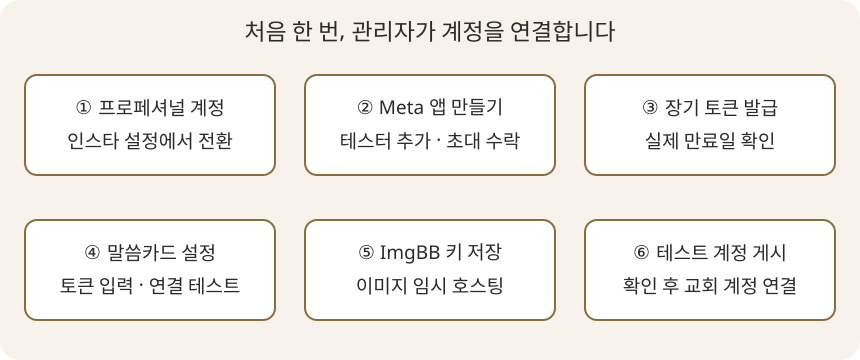

# 인스타그램 연결 안내

처음 연결할 때만 인터넷과 계정 관리자의 도움이 필요합니다. 카드 만들기와 PNG 저장에는 계정 연결이 필요 없습니다.

## 1. 준비하기

- 교회 인스타 계정을 프로페셔널 계정(비즈니스 또는 크리에이터)으로 전환합니다.
- 먼저 별도 테스트용 프로페셔널 계정으로 게시를 확인하세요.
- 계정 비밀번호를 말씀카드에 입력하지 않습니다.

## 2. Meta 앱 만들기

[Meta 개발자 페이지](https://developers.facebook.com/apps/)에 로그인해 앱을 만들고 Instagram API 제품을 추가합니다. **Instagram API with Instagram Login** 설정을 선택합니다. 대시보드 명칭과 화면 배치는 바뀔 수 있습니다.

아래 그림은 절차를 설명하는 안내 그림이며 실제 Meta 화면 캡처가 아닙니다.

앱을 개발 모드로 두고 역할/테스터 화면에서 대상 인스타 계정을 Instagram 테스터로 추가합니다. 해당 인스타 계정으로 로그인하여 앱 초대를 수락합니다. 다른 교회 계정에 배포하거나 앱 역할이 없는 계정을 지원하려면 Meta의 별도 권한 검토가 필요할 수 있습니다.

## 3. 액세스 토큰 발급

Instagram 설정에서 계정을 추가하고 토큰 발급을 진행합니다. 필요한 권한은 `instagram_business_basic`, `instagram_business_content_publish`입니다. **장기 토큰**을 사용하고 발급 화면의 실제 만료일을 기록하세요. 짧은 수명의 토큰을 60일 토큰으로 간주하면 안 됩니다.

토큰은 비밀번호처럼 보관합니다. 화면 캡처, 작업 파일, 메시지에 붙여 넣지 않습니다. 이 프로그램에는 앱 비밀번호나 앱 시크릿을 입력하는 기능이 없습니다. 대시보드가 장기 토큰을 제공하지 않으면 관리자가 공식 토큰 발급 절차를 완료해야 합니다.

## 4. 말씀카드에 연결

1. 말씀카드에서 **설정**을 엽니다.
2. **인스타 액세스 토큰** 칸에 붙여넣습니다.
3. **토큰 실제 만료일**을 선택합니다. 기본값은 오늘부터 60일이므로 기존 토큰이라면 반드시 수정합니다.
4. **연결 테스트 및 저장**을 누르고 `@계정명 연결됨`을 확인합니다.
5. 연결 테스트가 성공하면 연결 정보는 즉시 저장됩니다. 설정 창을 닫아도 연결은 유지됩니다.

토큰은 OS 자격 증명 저장소에만 보관됩니다. 설정 파일에는 계정 번호·이름·만료일만 저장됩니다. 만료 7일 전부터 실행 시 자동 갱신을 시도합니다. 인터넷이 끊겨 갱신에 실패해도 카드 만들기는 계속 사용할 수 있습니다. 만료된 경우 새 토큰으로 다시 연결합니다.

## 5. 이미지 호스팅 키 연결

[ImgBB API 페이지](https://api.imgbb.com/)에 로그인하여 키를 발급받고, 설정의 **ImgBB 이미지 호스팅 키**에 붙여넣고 **설정 저장**을 누릅니다. 키도 OS 자격 증명 저장소에 저장합니다. 이미지는 업로드할 때만 ImgBB에 임시 공개되며, 1시간 뒤 만료하도록 요청합니다.

## 6. 첫 게시

1. 카드를 1~10장 만들고 내용과 순서를 확인합니다.
2. **인스타에 올리기**를 누릅니다.
3. 캡션과 해시태그, 표시된 계정명을 확인합니다.
4. **올리기**를 누르고 최종 확인 창에서 진행합니다.
5. PNG 및 작업 파일 저장 후 이미지 준비와 게시가 진행됩니다.
6. **게시 완료 → 인스타에서 보기**를 누릅니다.

게시 후에는 이 프로그램에서 되돌릴 수 없습니다. 수정·삭제는 인스타그램에서 합니다. 최종 게시 요청 이후에는 취소해도 이미 게시되었을 수 있습니다.

## 문제가 생겼을 때

- **계정 확인 실패:** 프로페셔널 계정인지, 테스터 초대를 수락했는지, 두 권한이 있는지 확인하고 새 토큰을 발급합니다.
- **자격 증명 저장소 오류:** OS 사용자로 로그인했는지, Windows 자격 증명 관리자 또는 macOS 키체인이 사용 가능한지 확인합니다. 평문 파일로 대신 저장하지 않습니다.
- **이미지 준비 실패:** ImgBB 키, 인터넷 연결, 카드 장수와 이미지 파일을 확인합니다. 로컬 PNG는 그대로 남습니다.
- **게시 결과 불확실:** 인스타 계정을 직접 확인한 뒤에만 재시도합니다. 자동 저장된 작업에 확인 대기 기록이 남습니다.
- **게시 완료지만 링크 없음:** 게시 자체는 완료되었습니다. 인스타에서 확인하고 다시 올리지 마세요.

공식 참고: [Meta 게시 문서](https://developers.facebook.com/docs/instagram-platform/instagram-api-with-instagram-login/content-publishing/), [Meta 계정 연결 문서](https://developers.facebook.com/docs/instagram-platform/instagram-api-with-instagram-login/business-login/), [Meta 공식 API 모음](https://www.postman.com/meta/instagram/documentation/6yqw8pt/instagram-api), [ImgBB API](https://api.imgbb.com/).
